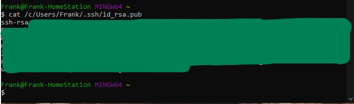

# How To Set Up GitLab Pull with SSH via GitBash  
  
This guide is to help walkthrough the steps needed to easily setting up folder that syncs on demand with an online GitLab repository for a Microsoft Windows computer. Steps for MacOS are sligthly different. With this guide, we will aim to achieve the following:  
   
- Generate a local SSH public/private rsa key pair.  
- Successfully clone an online GitLab repository to your local hard drive or machine.  
- Be able to `pull` updates from the repository when it is updated.  
- Do this all securely without relying on the use of passwords alone.  
    
--- 
---
   
## Prerequisites  
  
Some minor items are needed before we can get this achieved. Please complete them prior to getting started if they have not already been done so:  
  
- Have the lastest version of `GitBash` installed on your local machine.  
- Have access to the GitLab repository/ project that you are intending to sync or clone.  
- Created a free GitLab account to log in and access the GitLab repository shared to you (This is completely separate from GitHub as they are two different companies and services).  

---

## Set Up Your SSH Public/Private RSA Key Pair  
  
Launch `GitBash` from your local mahine. It should look something liks the following (This is completely different than your "Command Prompt" built into the Windows Operating System):

  
  
Enter the command: `ssh-keygen`  
*If this is the first key you are making, you can go ahead and leave it blank, then press `ENTER` to save the key to the default location. If this is a separate key you want to generate for this project, enter a custom filename you want to use.*
  
  
  
*If you already have a SSH Key set up in the system, it will prompt you to overwrite. If you want to overwrite this existing key, type `y` and press `enter`. If not, type `n` and press `enter`.  
  
  
  
This next step is OPTIONAL but recommended. This added step of adding a passphrase to your generated key will further encrypt the key, increasing the security of the key and likelihood of it being cracked. It is good practice to use a passphrase, but you can proceed without one. **NOTE: When typing out the passphrase, there will be no letters or characters visible, this is completely normal.**  

  

The resulting key after completing the above step will show your **PRIVATE** key. **Do not share this key.** The key you will need to copy is the **PUBLIC** key. (Two keys were generated in the RSA key pair).

The **public** key will be in the ".ssh" directory of the currently logged in user directory. Example highlighted below:  

  

To view this key, use the `cat` command to display the key contents.  
`cat /c/Users/Frank/.ssh/id_rsa.pub`  

*Include the entire contents of the key file, starting with "ssh-rsa..." all the way to the end after the logged in user and "...@computer-name."*  
  
  
  
You can copy this to the clipboard, you will need it shortly in the next step. You can keep this window open, we will be coming back to this after the next section.    

---
## Log Into The Shared GitLab Repository/ Project  

First, start by accessing the shared GitLab repository/ project that you were invited or granted access to. This should have come in the form of an email invitation from GitLab similar to this:   
   
   
  
Click on the project name and log into your GitLab account that you have created. If one was already created for you by the organization, please log in to this and set up your new password.

  

Once logged in, click on your user avatar in the top right corner of the screen. This may just be a circle with a letter inside if there are no photos or avatars uploaded. Then select the `Preferences` menu.    
  
  
  
Click and select the `SSH Keys` or the first "key" icon on the left column menu. You can expand the menu by clicking on the `>>` image.  

  
  
Paste the ENTIRE contents of the **PUBLIC** key from your computer from the previous section. A title may be automatically generated, but you can also customize this title for easier reference. The expiration date is *optional*. Without a set date, the key will not expire.  
  
When done, click on the "`Add key`" button.

  
  
---

## Cloning The Project Onto Your Local Machine  
  
Click on the orange fox logo for "GitLab" in the top left corner to return to your user main page. Then click on the project that you want to clone or sync to your machine.  
  
  
  
Next, click on the blue `Clone` button on the right side of the page.  The menu will drop down with two links to choose from. For our purposes, we will be selecting the `Clone with SSH` option. Copy the link by clicking once on the "clipboard" icon to the right of the link.  
  
  

Navigate back to your `GitBash` application on your local machine. You can choose to go to your `Documents` or `Downloads` directories to place this project, or a custom location of your choosing. The cloning process will create a new folder in the name of the project, so you do not have to create a separate one.  
  
Once you've decided, you will use the `git clone` command, followed by the path of the "SSH" link just copied in the last step. The command will look something like this:  

$ `git clone git@exampleprojectowner.com:Project-Folder/entire-project-name.git`  

Depending on how large the project is, this may take a few minutes or longer. When the process is complete, you will have a new sub-directory with the name of the project created and all of its contents inside.  

---
  
## Git Pull - Pulling Updates From The Project Folder  

Now that you have the cloned project in your local machine, when there are any updates online that you would like to pull and download, simply navigate INSIDE the directory of the project with `Git Bash` or navigate to it inside your GUI file manager, right click a blank space, and select `Git Bash Here` in the context menu.  

Once `Git Bash` is opened, you can run the command inside the project folder. Type `git pull` and enter in your passphrase (if you used one when generating your ssh key).  
  
Your updates should download automatically. If there are no updates online, a message will display saying "Already up to date."  

  

### Congratulations on setting up a simple repository/ project download folder that you can sync whenever there is an update!

---
Created 2022.04.14
